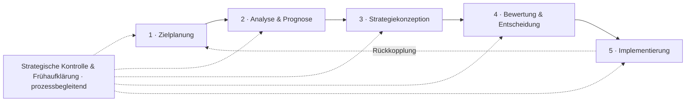

# Strategy Toolkit – Strategisches Management

🔗 **Zur Webseite: https://i-fichtner-i.github.io/Strategisches-Management/**

Ein interaktives Web-Werkzeug, das zentrale Methoden des strategischen Managements
anwendbar macht. Läuft vollständig im Browser – ohne Installation und ohne Server –
und lässt sich direkt über **GitHub Pages** veröffentlichen.

## Der strategische Managementprozess

Die Werkzeuge folgen den idealtypischen Phasen des strategischen
Managementprozesses. Die **strategische Kontrolle und Frühaufklärung** ist dabei
keine bloße Schlussphase, sondern läuft **prozessbegleitend** neben allen Phasen
mit und speist die Ergebnisse laufend in die Zielplanung zurück (Regelkreis).



| Phase | Werkzeuge |
|-------|-----------|
| 1 · Zielplanung | Abell · Stakeholder · SMART-Ziele |
| 2 · Analyse & Prognose | PESTEL · Five Forces · Szenario · Wertkette · VRIO-Check · SWOT · Portfolio |
| 3 · Strategiekonzeption | Strategietypen |
| 4 · Bewertung & Entscheidung | Strategiewahl (Nutzwertanalyse) |
| 5 · Implementierung | Business Model Canvas · Balanced Scorecard |
| *prozessbegleitend* | Frühwarn- & KPI-Tracker · Prämissenkontrolle |

## Werkzeuge

Die Werkzeuge folgen dem strategischen Management-Prozess – von der 

**Zielplanung über Analyse und Strategiewahl bis zur Umsetzung und Kontrolle**. 

*Jedes Werkzeug enthält eine Wissens-Ebene „Theorie & Leitfragen"**
--> Definition, Vorgehen, Leitfrage, sodass das Tool die typischen Fragestellungen beantwortet und zugleich durch die Anwendung führt.


| Werkzeug | Prozessphase | Was es tut |
|----------|--------------|-----------|
| **Abell-Marktabgrenzung** | Zielplanung | Den relevanten Markt über Kundengruppen, -funktionen und Technologien definieren. |
| **Stakeholder-Matrix** | Zielplanung | Anspruchsgruppen nach Macht und Interesse positionieren und passende Steuerungsstrategie ableiten. |
| **VRIO-Check** | Ansätze (RBV) / Unternehmensanalyse | Ressourcen und Fähigkeiten nach Valuable · Rare · Inimitable · Organized prüfen; die Wettbewerbsimplikation (Nachteil … dauerhafter Vorteil) wird automatisch abgeleitet. |
| **SMART-Ziele** | Zielplanung | Ziele formulieren und automatisch auf die fünf SMART-Kriterien prüfen. |
| **PESTEL-Analyse** | Umweltanalyse | Einflussfaktoren der globalen Umwelt in sechs Feldern erfassen. |
| **Porters Five Forces** | Umweltanalyse | Jede der fünf Wettbewerbskräfte über ihre einzelnen **Treiber** (sehr niedrig … sehr hoch) einstellen; daraus werden Kraftstärke und **Branchenattraktivität** automatisch berechnet. |
| **Wertkette** | Unternehmensanalyse | Primär- und Unterstützungsaktivitäten analysieren. |
| **Szenario-Analyse** | Umweltanalyse | Problem, Einflussfaktoren und zwei kontrastierende Zukunftsszenarien entwickeln. |
| **Strategische Kennzahlen** | Analyse & Steuerung | EBITDA/EBITDA-Marge und EVA berechnen; wert- vs. traditionell einordnen. |
| **SWOT-Analyse** | Zusammenführung | Analyse-Ergebnisse bündeln; leitet automatisch die vier **TOWS-Normstrategien** (SO / ST / WO / WT) ab. |
| **BCG-Portfolio** | Zusammenführung | Geschäftseinheiten nach Marktwachstum und relativem Marktanteil positionieren (Blasengröße = Umsatz): Stars / Question Marks / Cash Cows / Dogs. |
| **Business Model Canvas** | Umsetzung | Das Geschäftsmodell in neun Bausteinen entwickeln. |
| **Balanced Scorecard** | Umsetzung & Kontrolle | Die Strategie über vier Perspektiven in Ziele, Kennzahlen, Zielwerte und Maßnahmen übersetzen. |
| **Fallstudien-Report** | Analyse & Anwendung | Bericht für eine Fallstudie: Firmenauswahl aus einer Bibliothek mit **20 Unternehmensprofilen** (echte Eckdaten), gegliederte Struktur nach wissenschaftlichen Standards, Quellenverzeichnis, KI-Nutzungs-Doku und **Umfangszähler** (Seiten/Wörter). |
| **Selbsttest** | Wiederholung | Lernkarten und ein Multiple-Choice-Quiz mit Sofort-Feedback. |
| **Strategie-Dossier** | Gesamt­dokument | Fasst alle Werkzeuge in einem druckfertigen Bericht zusammen – inkl. eingebetteter Diagramme und automatischer Einordnung (Stakeholder-Strategie, BCG-Kategorie, Branchenattraktivität). Per „Als PDF exportieren" als PDF sicherbar. |

Alle Eingaben werden automatisch im Browser gespeichert (localStorage) und lassen
sich als PDF exportieren.

### Automatischer Datenfluss

Die Analyse-Ergebnisse fließen zusammen: In **PESTEL** und **Wertkette** lässt sich
jeder Eintrag per Symbol als positiv (＋) oder negativ (–) markieren. Diese Einträge
– zusammen mit den **Five-Forces**-Bewertungen (starke Kraft → Risiko, schwache Kraft
→ Chance) und den **VRIO**-Implikationen (Vorteil → Stärke, Nachteil → Schwäche) –
erscheinen automatisch im Bereich „Aus Analyse" der **SWOT** und speisen
die daraus abgeleiteten **TOWS-Normstrategien**.

```
Wertkette (＋/–) ──┐
VRIO-Check (RBV) ──┼─▶  SWOT  ─▶  TOWS-Normstrategien (SO · ST · WO · WT)
PESTEL   (＋/–)  ──┤
Five Forces      ──┘
```

## Nutzung

Lokal: `index.html` im Browser öffnen.

Online (GitHub Pages): In den Repository-Einstellungen unter **Settings → Pages**
als Quelle den Branch mit diesem Stand und den Ordner `/root` wählen. Die Seite ist
danach unter `https://<user>.github.io/Strategisches-Management/` erreichbar.

## Projektstruktur

```
├── index.html          Oberfläche & Navigation
├── assets/
│   ├── style.css       Gestaltung (inkl. Dark Mode)
│   └── app.js          Logik: SWOT, Five Forces, BCG-Portfolio
└── README.md
```

---

## Fachlicher Hintergrund – Themen

Die Werkzeuge orientieren sich an zentralen Themen des strategischen Managements.

### 1 Einführung in das Strategische Management

### 2 Ansätze des Strategischen Managements
- 2.1 Marktorientierter Ansatz (*Market-based View*)
- 2.2 Ressourcenbasierter Ansatz (*Resource-based View*)
- 2.3 Wissensbasierter Ansatz (*Knowledge-based View*)
- 2.4 Wertorientierter Ansatz (*Value-based View*)

### 3 Strategische Zielplanung
- 3.1 Stakeholder des Unternehmens
- 3.2 Zielhierarchie, Zielfunktionen und Zielbeziehungen
- 3.3 Finanzielle Ziele im Strategischen Management
- 3.4 Strategische Geschäftseinheiten und Geschäftsfelder

### 4 Strategische Analyse und Prognose
- 4.1 Analyse der Umwelt
  - 4.1.1 Globale Umwelt
  - 4.1.2 Branchenstruktur
  - 4.1.3 Wettbewerbsumfeld
- 4.2 Analyse des Unternehmens
- 4.3 Simultane Analyse des Unternehmens und der Umwelt

### 5 Strategieformulierung und -bewertung
- 5.1 Typen von Strategien
- 5.2 Bewertung und Auswahl von Strategien

### 6 Strategieentwicklung, -implementierung und Strategische Kontrolle
- 6.1 Strategieentwicklung – Das Business Model Canvas
- 6.2 Umsetzung und Durchsetzung von Strategien
- 6.3 Strategische Kontrolle und Frühaufklärung
